# homework-ZFS

Описание домашнего задания
---
1. Определить алгоритм с наилучшим сжатием
2. Определить настройки пула
3. Работа со снапшотами

---
- Этап 0: Подготовка для выполнения задания

Разворачиваем виртуалку посредствам Vagrant. Получаем ВМ с дополнительными дисками и предустановленным zfs

ОС для настройки: Ubuntu 22.04.4 LTS (в методичке предлагался centos7, решил попробовать другую, в целом, отличается только установкой самого zfs)

Vagrant версии 2.4.1

VirtualBox версии 7.0.18

*Ремарка, в методичке выделяется 512Мб памяти для создаваемых дисков, я выделил меньше в силу ограниченных ресурсов основной совей машины. 

---
- Этап 1: Определить алгоритм с наилучшим сжатием

Смотрим список всех дисков

```bash
lsblk
```  
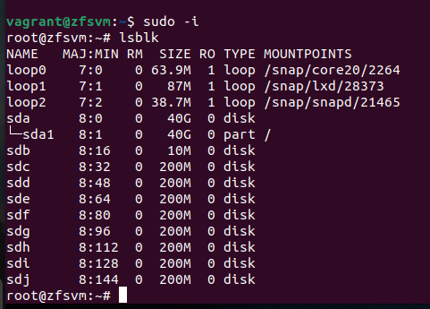

Создаём пул из двух дисков в режиме RAID 1

```bash
zpool create otus1 mirror /dev/sdc /dev/sdd
zpool create otus2 mirror /dev/sde /dev/sdf
zpool create otus3 mirror /dev/sdg /dev/sdh
zpool create otus4 mirror /dev/sdi /dev/sdj
```  
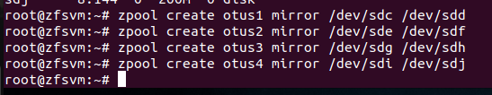


Смотрим информацию о пулах

```bash
zpool list
```  
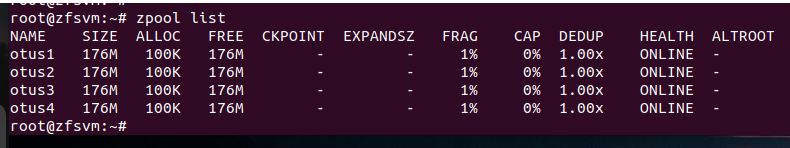


И их статусы

```bash
zpool status
```  
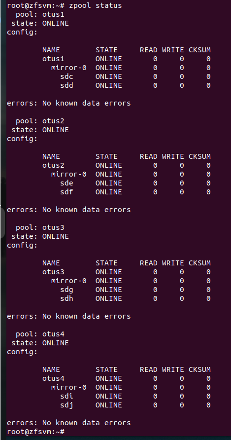


Добавляем разные алгоритмы сжатия в разные файловые системы

```bash
zfs set compression=lzjb otus1
zfs set compression=lz4 otus2
zfs set compression=gzip-9 otus3
zfs set compression=zle otus4
```  
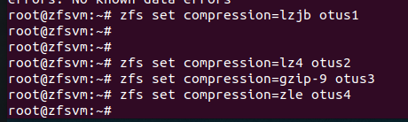


Проверяем (обращаем внимание на методы сжатия)

```bash
zfs get all | grep compression
```  
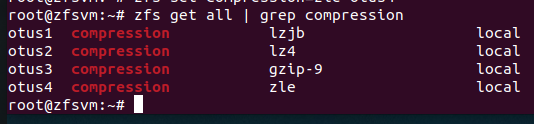


Качаем одинаковый файл во все пулы, проверяем

```bash
# команда из методички без изменений, на убунте тоже работает (круто, использование цикла, запомнить)
for i in {1..4}; do wget -P /otus$i https://gutenberg.org/cache/epub/2600/pg2600.converter.log; done
```  
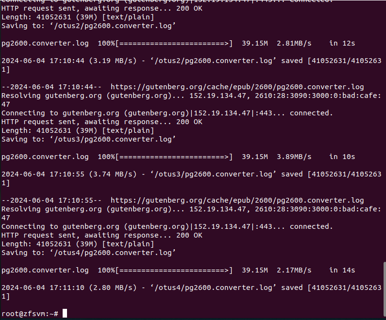

```bash
ls -l /otus*
```  
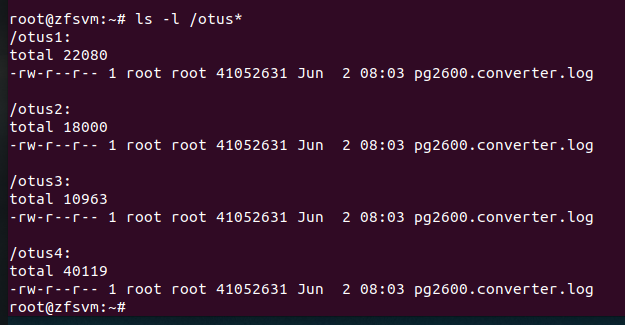

Проверяем занятое место в разных пулах (помним, что у них разные методы сжатия) 

```bash
zfs list
```  
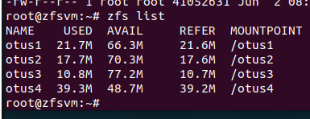

Смотрим компрессию 

```bash
zfs get all | grep compressratio | grep -v ref
```  
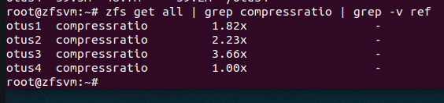


```bash
# Делаем вывод, что самый наилучший метод сжатия имеет алгоритм gzip-9
```  

---

- Этап 2: Определить настройки пула.

Скачиваем архив и распаковываем его

```bash
wget -O archive.tar.gz --no-check-certificate 'https://drive.usercontent.google.com/download?id=1MvrcEp-WgAQe57aDEzxSRalPAwbNN1Bb&export=download'
```  
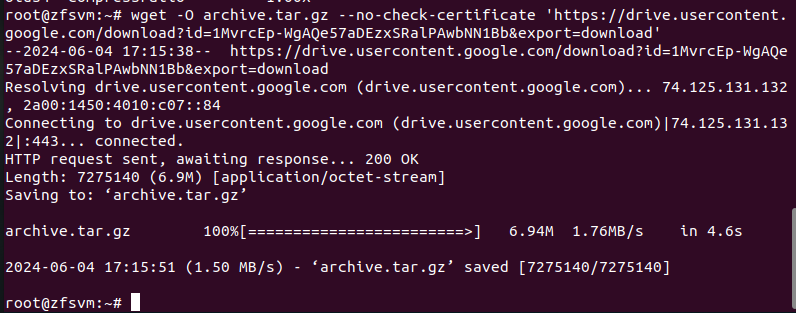

```bash
tar -xzvf archive.tar.gz
```  
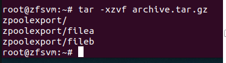


Проверяем возможность импортирования скаченного архива. 

```bash
zpool import -d zpoolexport/
# Имя: otus
# Тип рэйда: mirror-0
# Состав: filea + fileb
```  


Импортируем пул себе в ОС, проверяем статус. 

```bash
zpool import -d zpoolexport/ otus
zpool status
```  
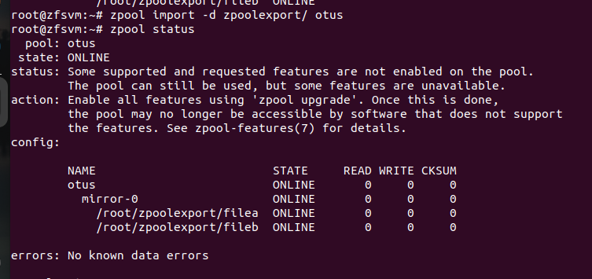


Проверяем все доступные параметры файловой системы. 

```bash
zfs get all otus
```  
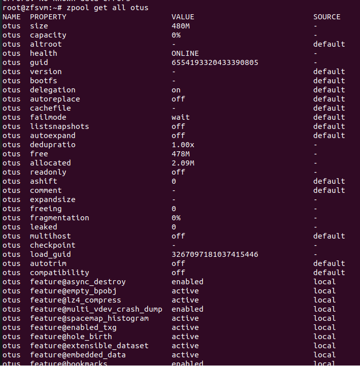


Проверяем нужные нам параметры файловой системы. 

```bash
zfs get available otus
```  
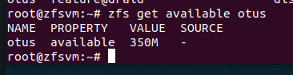

```bash
zfs get readonly otus
```  
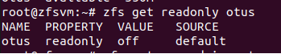

```bash
zfs get recordsize otus
```  
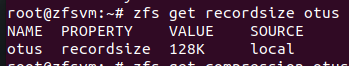

```bash
zfs get compression otus
```  
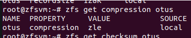

```bash
zfs get checksum otus
```  
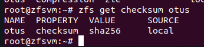

---

- Этап 3: Работа со снапшотом, поиск сообщения от преподавателя.

Скачиваем файл задания 

```bash
wwget -O otus_task2.file --no-check-certificate https://drive.usercontent.google.com/download?id=1wgxjih8YZ-cqLqaZVa0lA3h3Y029c3oI&export=download
# Тут чего-то консоль немного подзалипла, пришлось пнуть
```  
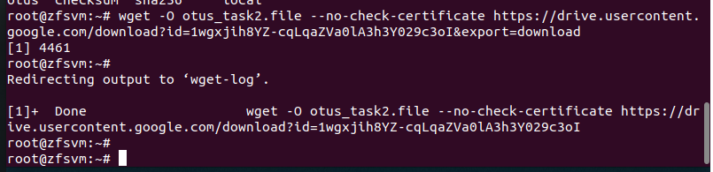


Восстановление ФС из снапшота 

```bash
zfs receive otus/test@today < otus_task2.file
# Стоит отметить, что весьма простой процесс восстановления 
```  
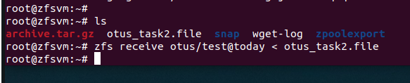


Ищем в каталоге /otus/test файл с именем “secret_message” 

```bash
find /otus/test -name "secret_message"
```  
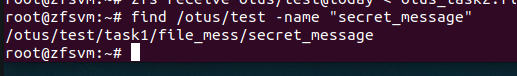


Нашли 

```bash
nano /otus/test/task1/file_mess/secret_message
```  
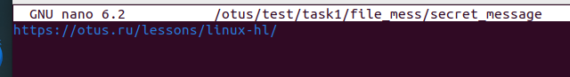


